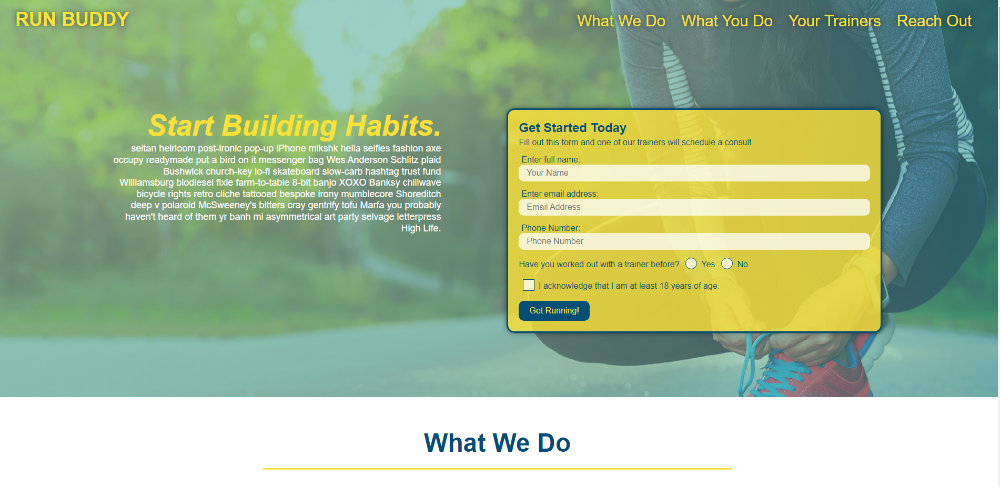

# Run Buddy, Inc.

- Github URL: https://github.com/DanielCConlon/run-buddy
- github pages: https://danielcconlon.github.io/run-buddy/

## Table-of-Contents

- [Description](#description)
- [Usage](#usage)
- [Application](#application)

## [Description](#description)

A website that offers fitness training services. Built following a course module using HTML and CSS.

## [Usage](#table-of-contents)

Go to the website and follow whats shown on screen.

## [Application](#table-of-contents)

